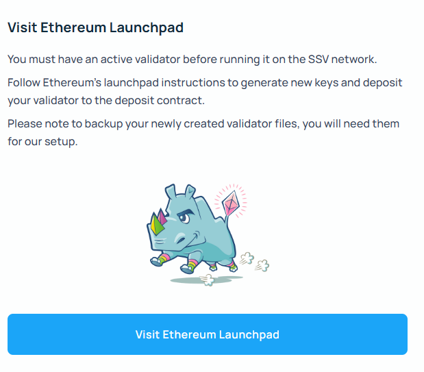
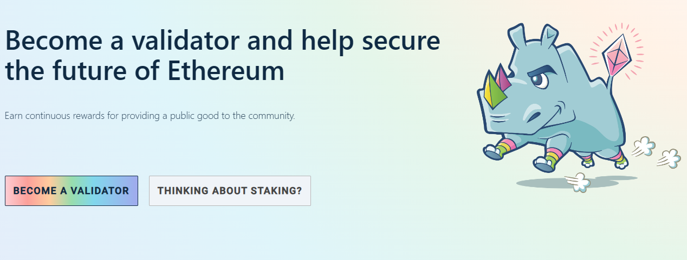
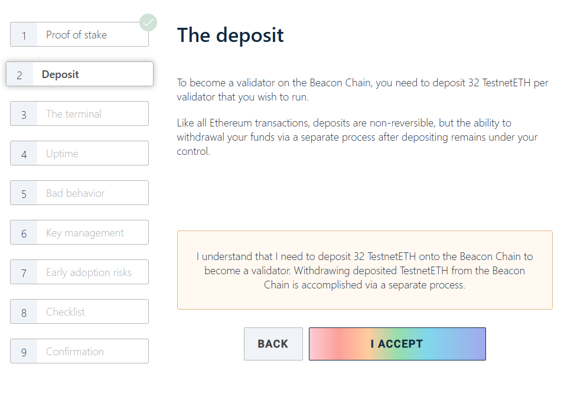
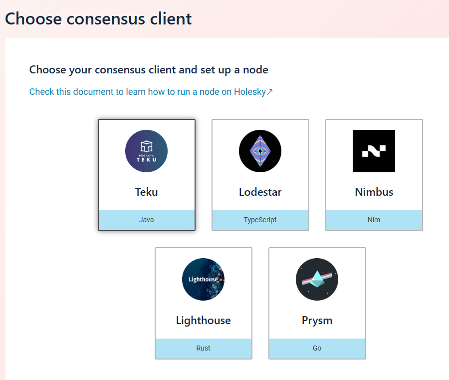
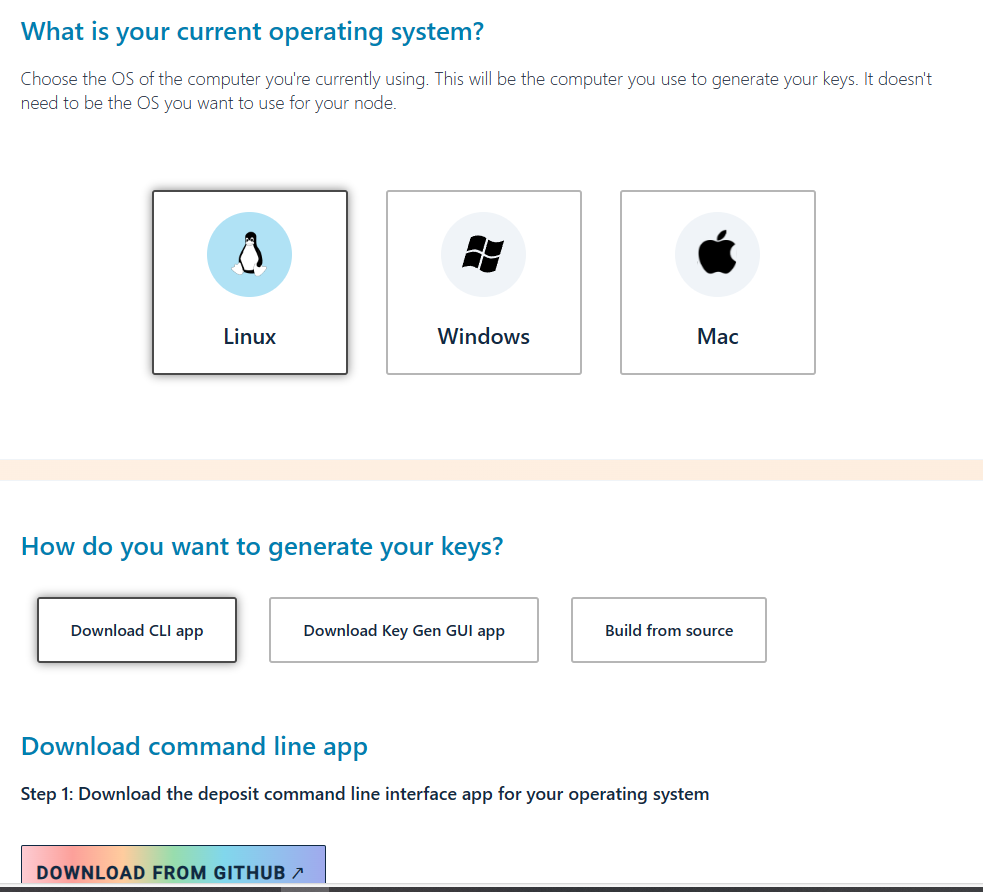
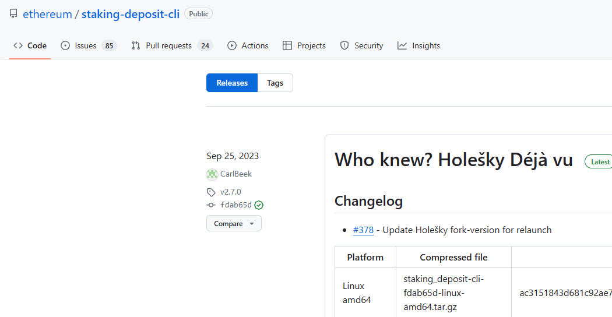

# Distribute your validator to run on the SSV network.
We need to use MetaMask as it is seems to be working best connecting web3 wallets to the testnet in Edge or Chrome.

Goals:
1. Create a new eth validator
2. Get HolSSV for testing funding validators and staking
3. Setup a validator on SSV.network

---
# 1. [launchpad](https://holesky.launchpad.ethereum.org/en/)

---
---
# 2. [Become A Validator](https://holesky.launchpad.ethereum.org/en/overview)

---
---
# 3. [Deposite HolEth](https://holesky.launchpad.ethereum.org/en/overview)

---
---
# 4. [For SSV Skip installation of execution client and consensus client](https://holesky.launchpad.ethereum.org/en/select-client)

---
---
# 5. [Generate Keys](https://holesky.launchpad.ethereum.org/en/generate-keys)

---
---
# 6. [github Official Download Link](https://github.com/ethereum/staking-deposit-cli/releases/)

---